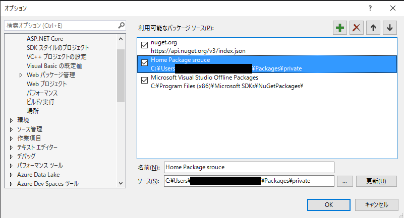

# Chatwork API
## 概要

これはChatwork APIを.NETで使用するためのライブラリです。
`.NET6`で開発しているため、クロスプラットフォームでの開発が可能です。

サポートされているフレームワークのバージョンについては以下のページを参照してください。

[\.NET 6\.0 \(Linux、macOS、Windows\) をダウンロードする](https://dotnet.microsoft.com/ja-jp/download/dotnet/6.0)

## Visual Studioの設定

Visual StudioからNuGetパッケージの設定を行ってから、プロジェクトへの参照を追加してください。

### オプションからNuGetパッケージの場所を指定する

[ツール] - [オプション]を開き、[NuGet パッケージ マネージャー] - [パッケージ ソース]を選択します。
"名前"を入力し、"ソース"に`.nupkg`を配置したパスを設定します。



### プロジェクトからNuGetパッケージを追加する

Visual Studioのプロジェクトから[NuGetパッケージの管理]を選択します。
"パッケージ ソース"を先程入力した"名前"に設定してから`ChatworkApi`をインストールします。

## 使い方

このAPIを使用する場合は以下の`using`を追加してください。

```cs
using ChatworkApi;
```

APIへのアクセスには`ClientApi`に`API Token`を設定してインスタンス化します。

```cs
var client = new Client(new HttpClient());
client.ApiToken(apiToken);
```

それぞれのAPIは次のようにアクセスします。

```cs
var me = await client.Me.GetMeAsync().Result.Content;

var myStatus = await client.My.GetMyStatusAsync().Result.Content;

var works = await client.My.GetMyTasksAsync(null, TaskStatus.Open).Result.Content;
```

全体の構成としては次のようになります。

```cs
namespace ChatworkApi.Debugs.Console;

using System;
using System.IO;
using System.Linq;
using System.Net.Http;
using System.Text;

internal class Program
{
    private static void Main(string[] args)
    {
        Client client   = new Client(new HttpClient());
        client.ApiToken(apiToken);
        
        Me me = client.Me.GetMeAsync().Result.Content;
        Console.WriteLine($"所属:{me.organization_name}, 氏名:{me.name}, ID:{me.account_id}");
        
        MyStatus myStatus = client.My.GetMyStatusAsync().Result.Content;
        Console.WriteLine($"未読のある部屋の数:{myStatus.unread_room_num}"
                        + $", 返信のある部屋の数:{myStatus.mention_room_num}"
                        + $", タスクのある部屋の数:{myStatus.mytask_room_num}"
                        + $", 未読の数:{myStatus.unread_num}"
                        + $", 返信の数:{myStatus.mention_num}"
                        + $", タスクの数:{myStatus.mention_num}");

        IEnumerable<MyTask> works = client.My.GetMyTasksAsync(null, TaskStatus.Open).Result.Content;
        Console.WriteLine("- 自分に割り当てられた未完了タスク一覧");
        Console.WriteLine($"{string.Join(Environment.NewLine, works.Select(x => $"{x.limit_type}-{x.limit_time}{Environment.NewLine}{x.assigned_by_account.name}, {x.room.name}{Environment.NewLine}{x.body}"))}");
    }

```

### メッセージAPI

Chatwork用のメッセージフォーマットを作成するためのAPIです。

[Chatwork メッセージ記法](http://developer.chatwork.com/ja/messagenotation.html)

メッセージAPIを使うには以下の`using`を追加してください。

```cs
using ChatworkApi.Messages;
```

`MessageBuilder`をインスタンス化し、返信先やメッセージ本文などを設定します。
必要な情報を設定したら`.Build()`メソッドを呼び出すと、Chatworkのメッセージ記法文字列が構築されます。

```cs
ChatworkApi.Messages.MessageBuilder builder = new MessageBuilder();

// "[To:1234567890]"
string toUserMessage = builder.To.Add(1234567890).Build();

// "[To:1234567890]田中 太郎 さん"
string toUserWithName = builder.To.Add(1234567890, "田中 太郎 さん").Build();

// "[To:1234567890]ご連絡いただきありがとうございます。"
string toUserWithMessage = builder.To.Add(1234567890)
                                    .Add("ご連絡いただきありがとうございます。")
                                    .Build();

// "[To:1234567890]
// ご連絡いただきありがとうございます。"
string toUserNewLineWithMessage = builder.To.Add(1234567890)
                                            .AddNewLine()
                                            .Add("ご連絡いただきありがとうございます。")
                                            .Build();

// "[rp aid=1234567890 to=1234-987654321]
// ご確認いただきありがとうございました。"
string reply = builder.Reply.Add(1234567890, 1234, "987654321")
                    .AddNewLine()
                    .Add($"ご確認いただきありがとうございました。")
                    .Build();

// "[toall]
// ハロウィンパーティーのお知らせです。詳細は以下のとおりです。みなさまのご参加をお待ちしております！！！
// [info][title]～ハロウィン パーティ開催のお知らせ～[/title]・日時：2019年10月31日 17時00～　(２時間程度)
// ・参加費：\1,000
// ・その他：コスプレ衣装での参加も歓迎します！[/info]"
string toAllWithInfo = builder.To.All()
                                .AddNewLine()
                                .Add($"ハロウィンパーティーのお知らせです。詳細は以下のとおりです。みなさまのご参加をお待ちしております！！！")
                                .AddNewLine()
                                .Information.Add("～ハロウィン パーティ開催のお知らせ～"
                                                , $"・日時：2019年10月31日 17時00～　(２時間程度){Environment.NewLine}"
                                                + $"・参加費：\\1,000{Environment.NewLine}"
                                                + $"・その他：コスプレ衣装での参加も歓迎します！")
                                .Build();

// "[引用 aid=1234567890 time=1571899391]昨日送ったメールはご覧になっていただけたでしょうか？[/引用]
// 確認したので資料添付して返しました。ご確認をお願いします。"
string quote = builder.Quote.Add(1234567890
                                , new DateTime(2019, 10, 24, 15, 43, 11)
                                , $"昨日送ったメールはご覧になっていただけたでしょうか？")
                        .AddNewLine()
                        .Add("確認したので資料添付して返しました。ご確認をお願いします。")
                        .Build();
```

## 使用可能なAPI

Chatwork社によって公開されている以下のAPIのうち、テスト済みのAPIの一覧です。

[Chatwork APIドキュメント](http://developer.chatwork.com/ja/endpoints.html)

| メソッド | リクエストURI | 対応するAPI | テスト済 |
|:--------------|:------------|:----------|:------:|
| GET | /me | GetMeAsync | :white_check_mark: |
| GET | /my/status | GetMyStatusAsync | :white_check_mark: |
| GET | /my/tasks | GetMyTasksAsync | :white_check_mark: |
| GET | /contacts | GetContactsAsync | :white_check_mark: |
| GET | /rooms | GetMyRoomsAsync | :white_check_mark: |
| POST | /rooms | CreateNewRoomAsync | :white_large_square: |
| GET | /rooms/{room_id} | GetRoomConfigurationAsync | :white_check_mark: |
| PUT | /rooms/{room_id} | UpdateRoomConfigurationAsync | :white_large_square: |
| DELETE | /rooms/{room_id} | LeavingRoomAsync | :white_large_square: |
| GET | /rooms/{room_id}/members | GetRoomMembersAsync | :white_check_mark: |
| PUT | /rooms/{room_id}/members | UpdateRoomMembersAsync | :white_large_square: |
| GET | /rooms/{room_id}/messages | GetMessagesAsync | :white_check_mark: |
| POST | /rooms/{room_id}/messages | AddMessageAsync | :white_check_mark: |
| PUT | /rooms/{room_id}/messages/read | ReadMessageAsync | :white_large_square: |
| PUT | /rooms/{room_id}/messages/unread | UnreadMessageAsync | :white_large_square: |
| GET | /rooms/{room_id}/messages/{message_id} | GetMessageAsync | :white_large_square: |
| PUT | /rooms/{room_id}/messages/{message_id} | UpdateMessageAsync | :white_large_square: |
| DELETE | /rooms/{room_id}/messages/{message_id} | DeleteMessageAsync | :white_large_square: |
| GET | /rooms/{room_id}/tasks | GetRoomTasksAsync | :white_large_square: |
| POST | /rooms/{room_id}/tasks | AddTaskAsync | :white_check_mark: |
| GET | /rooms/{room_id}/tasks/{task_id} | GetRoomTaskAsync | :white_large_square: |
| PUT | /rooms/{room_id}/tasks/{task_id}/status | UpdateTaskStatusAsync | :white_check_mark: |
| GET | /rooms/{room_id}/files | GetFilesAsync | :white_large_square: |
| POST | /rooms/{room_id}/files | UploadFileAsync | :white_large_square: |
| GET | /rooms/{room_id}/files/{file_id} | GetFileAsync | :white_large_square: |
| GET | /rooms/{room_id}/link | GetInviteLink | :white_large_square: |
| POST | /rooms/{room_id}/link | CreateInviteLink | :white_large_square: |
| PUT | /rooms/{room_id}/link | UpdateInviteLink | :white_large_square: |
| DELETE | /rooms/{room_id}/link | DeleteInviteLink | :white_large_square: |
| GET | /incoming_requests | GetContactApprovalRequestsAsync | :white_large_square: |
| PUT | /incoming_requests/{request_id} | ConfirmContactApprovalRequestAsync | :white_large_square: |
| DELETE | /incoming_requests/{request_id} | CancelContactApprovalRequestAsync | :white_large_square: |

## ライセンス

なし
